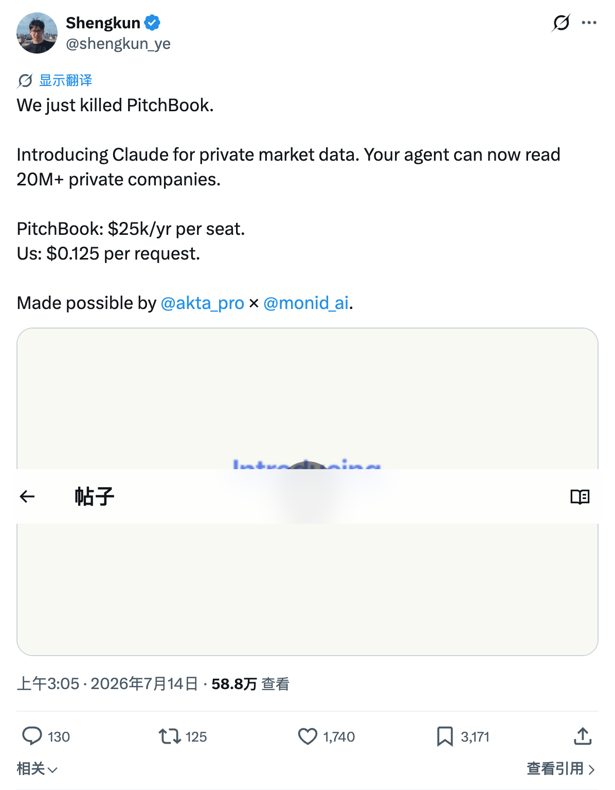

# Shengkun Ye: Akta x Monid private-market data demo

创始人帖文：用 “We just killed PitchBook” 介绍 Akta × Monid 的 private-market data endpoint，主张覆盖 20M+ private companies，并把 PitchBook `$25k/year/seat` 与 `$0.125/request` 对比。

2026-07-22 页面显示约 58.8 万 views、1,740 likes、3,171 bookmarks、125 reposts、130 replies。

判断边界：S1 创始人 demo 和 GTM 证据。不能证明 Monid 已替代 PitchBook、Akta 数据全面等价、20M+ coverage 已独立审计，或大量 viewers 已付费采用。
