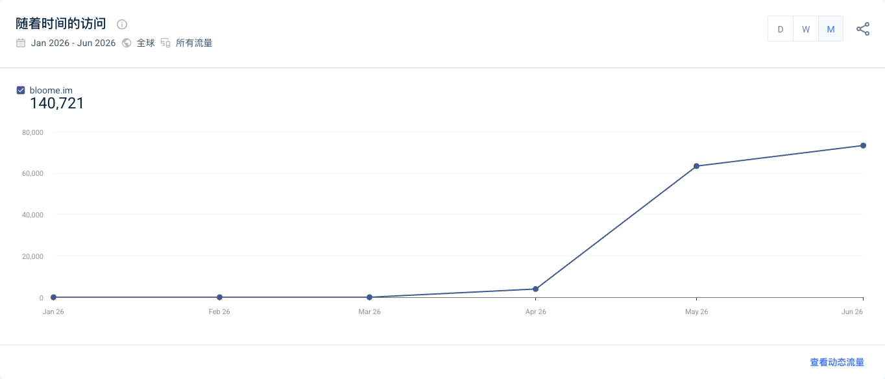

## 快照

Similarweb 对 bloome.im 的第三方估算，时间范围为 2026-01-01 至 2026-06-30，全球、所有流量、主域名口径。

| 月份 | 估算访问量 |
|---|---:|
| 2026-01 | 0 |
| 2026-02 | 0 |
| 2026-03 | 0 |
| 2026-04 | 3,973.81 |
| 2026-05 | 63,407.16 |
| 2026-06 | 73,339.75 |

总计约 140,721。Direct 69.19%、Referral 12.50%、Organic Social 10.22%、Organic Search 4.63%；中国 54.39%、美国 24.85%。社交流量内部 Instagram 89.37%、X 10.63%。

## 边界

第三方估算只用于判断量级、结构和变化方向，不能替代第一方 analytics，也不能单独证明 KOL、发布或活动导致增长。平台没有返回可靠的类似网站列表。

来源：[[source.bloome.similarweb]]。
