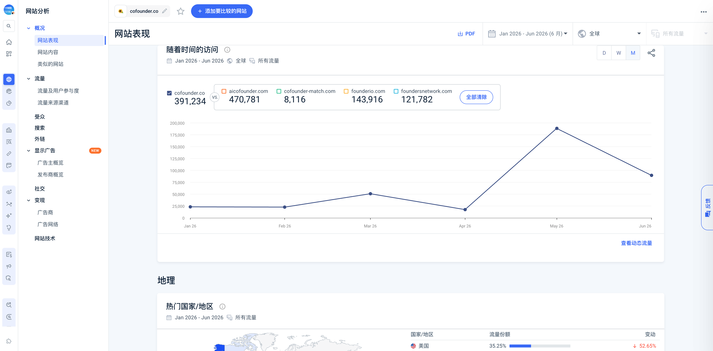

Cofounder 根域名 2026 年 1-6 月第三方访问估算。

月访问约为：1 月 23,051；2 月 22,516；3 月 50,661；4 月 17,280；5 月 188,303；6 月 89,423，半年合计约 391,234。

5 月峰值与 Cofounder 2 发布同窗，支持“重新发布带来注意力放大”的判断；不证明所有流量均来自发布，也不等于注册、付费或留存。数据源：[[source.similarweb.cofounder-2026-07-15]]。
