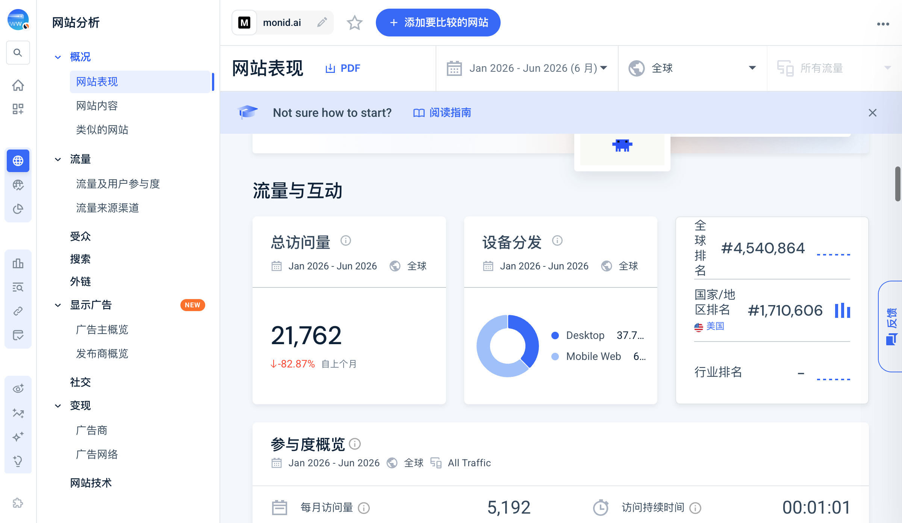
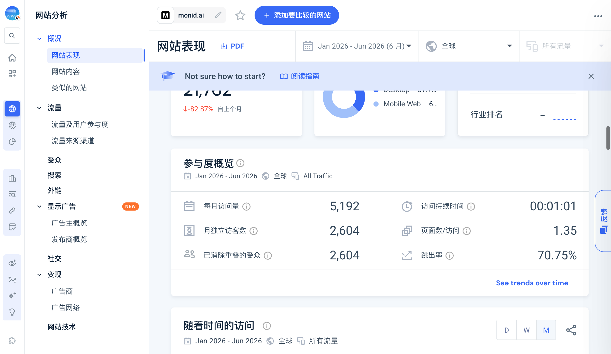
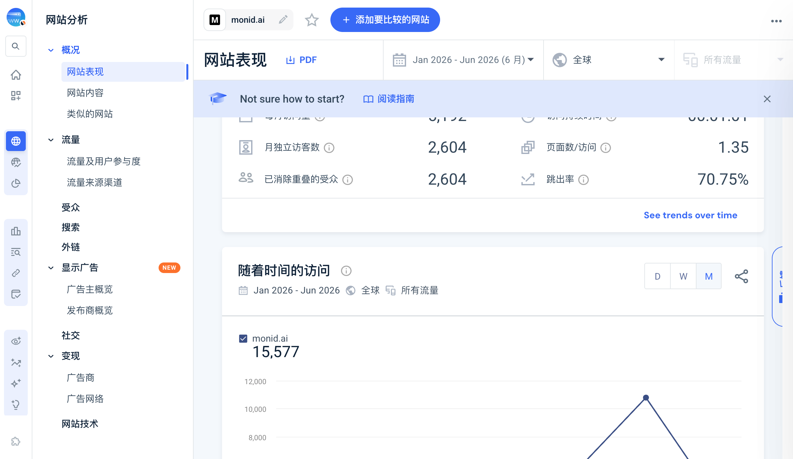

# Monid Similarweb Jan-Jun 2026

Scope：`monid.ai` root；Jan-Jun 2026 closed 6m；Worldwide；All Traffic；include_subdomains=false。

## Displayed snapshot

- total visits：21,762；displayed change：-82.87%。
- monthly visits：5,192；monthly unique：2,604；deduplicated audience：2,604。
- duration：00:01:01；pages/visit：1.35；bounce：70.75%。
- desktop/mobile：37.79% / 62.21%。
- global rank：#4,540,864；US rank：#1,710,606；category unavailable。

## Raw chart and conflicts

Jan-Jun raw：`0, 0, 0, 3891.8942, 10808.4463, 876.5440`。

- sum = 15,576.8845，和 legend 15,577 对齐，但不等于 displayed total 21,762。
- all-six average = 2,596.1474，不等于 monthly card 5,192。
- Apr-Jun non-zero average = 5,192.2948，与 monthly card 机械吻合；仅记录关系，不声明 provider 规则。
- chart MoM = -91.8902%，不等于 displayed -82.87%。

保留三个 provider-internal conflicts。网站 traffic 不能替代 API usage、客户、收入或 adoption。

来源：[[source.similarweb.monid-2026-h1]]。
